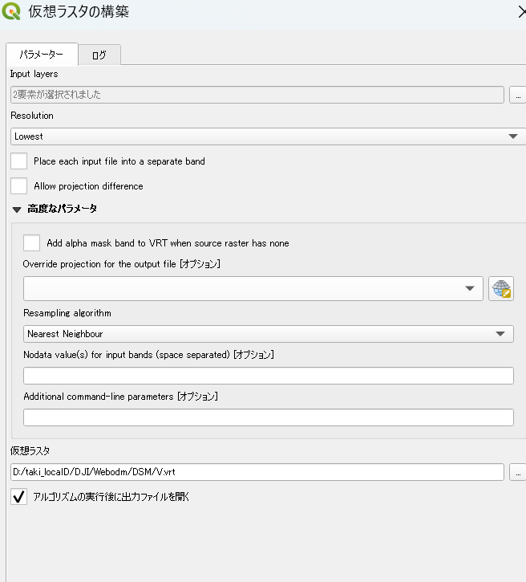
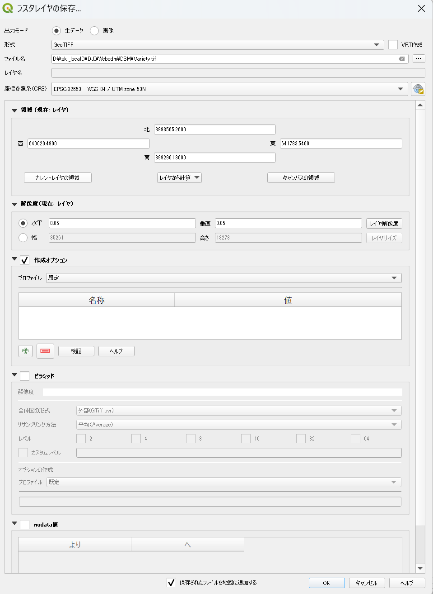

# QGISを使用した複数DSM（Digital Surface Model）ファイルの統合とエクスポート

## 作業概要

### ステップ1: 入力ファイルの確認

- **.tif**: 14608×9590ピクセル、ピクセルサイズ0.05m、座標系EPSG:32653、nodata値 -9999
- 両ファイルとも32bit Float32形式、DEFLATE圧縮

### ステップ2: 仮想ラスタ（VRT）の作成

**QGISメニュー**: ラスタ → その他 → 仮想ラスタの構築

**設定内容**:

- **Input layers**:2ファイルを選択
- **Resolution**: Lowest（最低解像度）
- **Place each input file into a separate band**: ✗ チェックなし（重要）
- **出力ファイル**: .vrt

	

**結果**: 1つのバンドを持つ統合VRTが作成され、座標系とメタデータが完全に保持されました。

### ステップ3: VRTの確認

作成された.vrtのプロパティを確認：

- **バンド数**: 1（統合完成）
- **座標参照系**: EPSG:32653 - WGS 84 / UTM zone 53N
- **標高値範囲**: 648.25〜998.86m
- **ピクセルサイズ**: 0.05m × 0.05m
- **nodata値**: -9999
- **有効データ率**: 58.53%（2つのファイルの部分的重複により妥当）

### ステップ4: GeoTIFFへのエクスポート

**操作**: .vrtを右クリック → エクスポート → 名前を付けて保存

**エクスポート設定**：[^5][^6]

- **形式**: GeoTIFF
- **ファイル名**: D:\taki_localD\DJI\Webodm\DSM\Variety.tif
- **座標参照系**: EPSG:32653（保持）
- **解像度**: 水平・垂直 0.2m
- **圧縮**: オプション（必要に応じてDEFLATE + ZLEVEL=9推奨）
- **ピラミッド**: 不要

	

***

