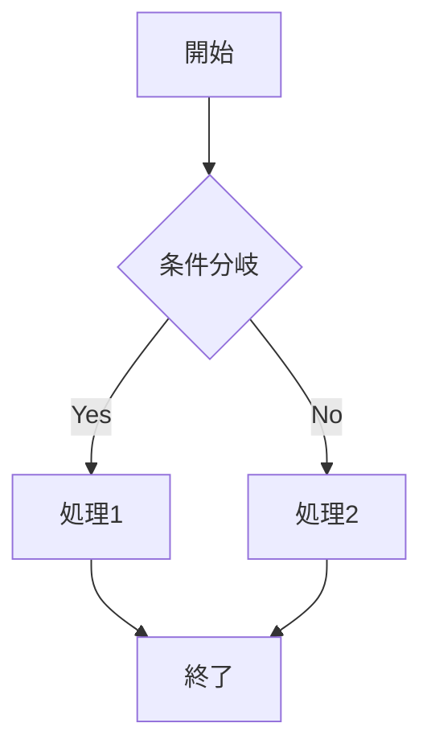
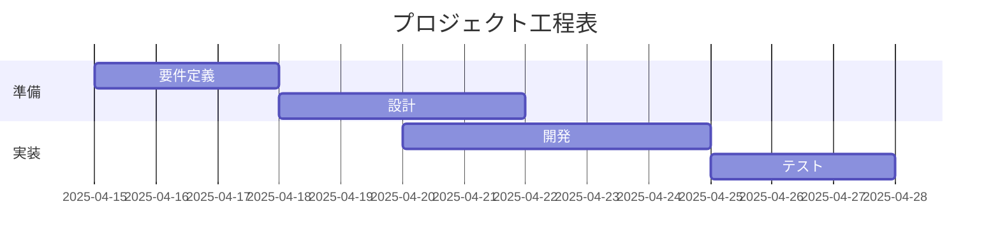

# 🧠 AIチャット × Markdown  
## 最強の相性！

2025/4/16 梅本

---

## 📌 なぜMarkdown？

| 特徴 | AIとの相性が良い理由 |
|------|------------------------|
| **シンプルな記法** | 読みやすく、AIが正確に解釈しやすい |
| **構造化された表現** | 見出し・リスト・表などで論理構造が明確になる |
| **コードブロック対応** | プログラムや数式をそのまま記述でき、コピペも楽 |
| **互換性の高さ** | GitHubやNotionなど多くのツールでそのまま使える |
| **AI出力との親和性** | AIがMarkdown形式で返すことで読みやすさUP |

---

## 📊 Markdown出力が役立つシーン

- 📝 資料作成
  * そのままMarpスライドに
  * Latexへの変換もスムーズ！
- 📚 ノート整理（Obsidianに貼るだけ）
- 🔢 数式を使った説明（LaTeX数式）

---

## 💡 Markdown出力をAIに頼むコツ

- 「**Markdown形式で**」「**コードブロックで**」など明示する
- 数式は `$...$` や `$$...$$` で囲もう
- Marp形式ならスライド作成も楽々！

---

## ✍️ 具体例：制御工学の安定性評価

### ユーザーの質問

`$\dot{x} = Ax + Bu$`の安定性を評価する方法を教えてください。 LaTeX数式つきで説明して。

### 🤖 AIの返答（例）

1. システム：$\dot{x} = Ax$

2. Lyapunov候補関数：$V(x) = x^T P x$
ただし、$P > 0$

このとき、
$$
\dot{V}(x) = x^T (A^T P + P A) x
$$
が負定であれば、原点は漸近安定。

---

## 🧩 Mermaid.js で図を描こう！

**図・フロー**

- Markdownに直接書ける
- Obsidian・Marp・GitHubでも使える
- フローチャート、シーケンス図など対応

---

## 🛠 工程表も！

- `gantt` ブロックでガントチャートも簡単作成！
- スケジュール管理にも最適

---

## 🚀 まとめ

### ✅ AIチャットとMarkdownは…

- 情報整理に最適
- コーディングとの相性抜群
- あらゆる場面で応用できる！

---

## 🎁 おまけ：このスライドもMarkdownだけで作られています！

> Marpを使えば、**AIの出力をそのままプレゼン資料に！**

つまり・・・

## **Markdownは使えるとすごく便利！**

そしてすぐ使えるようになる！

---

## Marpに限り注意あり

HTMLとCSSがわからないと、うまく調整ができません。Markdownだけでは厳しいときもある。

HTML、CSSはシンプルなのでAI Chatに聞きながら書けばよい。

---
