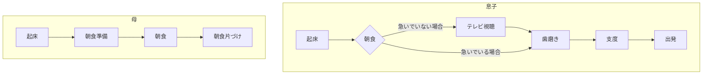
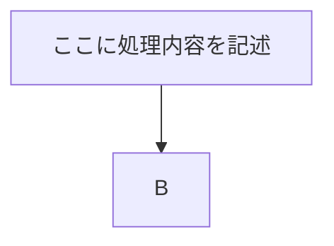
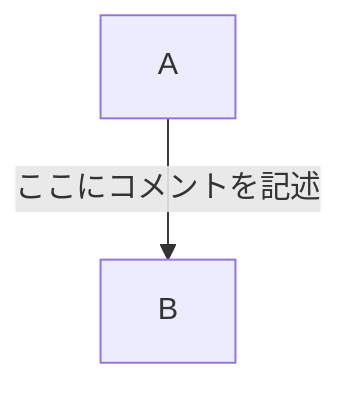
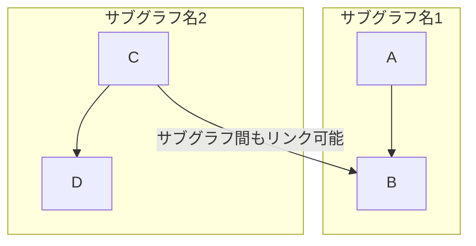

## マーメイドの使い方

### 書き方の例



こんなふうに書く

```bosh
```mermaid
flowchart TD

subgraph 息子
a1[起床]-->a2{朝食}
a2-->|急いでいない場合|a3[テレビ視聴]-->a4[歯磨き]
a2-->|急いでいる場合|a4
a4-->a5[支度]-->a6[出発]

subgraph 母
b1[起床]-->b2[朝食準備]-->b3[朝食]-->b4[朝食片づけ]
end
```
```








