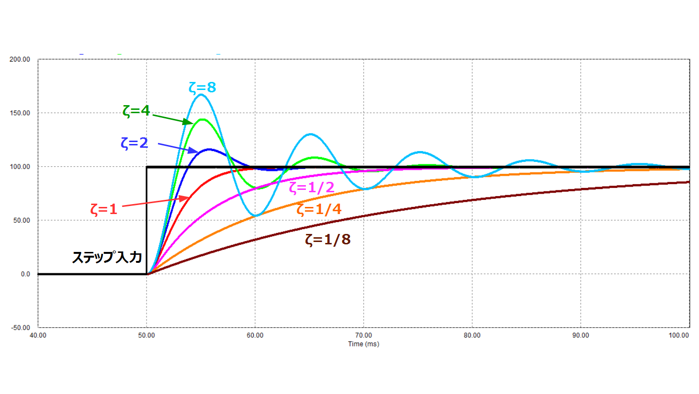

# ArduPilot sysidmode を使ったモデルとPID最適化

## 手法1：2階遅れシステム + 最小二乗最適化

### 基本原理

ドローンの姿勢制御系を2階遅れシステム図1 $\frac{\omega_n^2}{s^2 + 2\zeta\omega_n s + \omega_n^2}$ でモデル化し、実測データとモデルの誤差を最小二乗法で最小化することでPIDゲインを決定する。

**2階遅れシステム：**

```
[sysidフライト実施]
  Chirp入力信号（10-50Hz）
       ↓
[段階1：システム同定]
  目的：ωn（固有振動数）とζ（減衰比）を推定
  手法：入力をモーターへの指令値、出力をロール・ピッチの角度としたモデルを最小二乗法で残差最小化
       ↓
  結果：ωn = 25.3 rad/s, ζ = 0.68
       ↓
[段階2：PIDゲイン最適化]
  目的：性能要求を満たすKp, Ki, Kdを算出
  手法：段階1のωn, ζを固定して最適化
       ↓
  結果：Kp, Ki, Kd
       ↓
[ArduPilotパラメータ設定]
  ATC_RAT_RLL_P/I/D に書込み
```


### 特徴



図１: 二次遅れ要素の模式図  
出典: 制御工学の基礎二次遅れ要素とヘビサイドの展開定理 — https://blog-firststep.com/transientsecond/


**2階遅れシステム：**
- 物理的妥当性：慣性モーメントによる2階微分方程式
- パラメータの明確性：ωn（応答速度）、ζ（振動の程度）が直感的
- ArduPilot適合性：カスケード制御構造に最適

**最小二乗最適化の利点：**

- 凸最適化に近い問題で収束が速い
- パラメータ数が少ない（ωn, ζの2個）

***

## 手法2：周波数領域システム同定 + 線形二次最適制御(LQR)

### 基本原理

周波数領域でシステムを同定し、最適制御理論（LQR）によって数学的に最適なゲインを計算する
### プロセスフロー

```
[sysidフライト実施]
  同上
       ↓
[周波数領域変換]
  FFT(高速フーリエ変換)
       ↓
[周波数応答計算]
  Bode線図作成（振幅・位相特性）
       ↓
[伝達関数フィッティング]
  モデル構造選択（次数、極配置）
  正則化パラメータ調整

       ↓
  結果：G(s) = K/(as² + bs + c)
       ↓
[状態空間表現への変換]
  A, B, C行列の構築
       ↓
[LQR最適化]
  重み行列Q, Rを設定
  Riccati方程式求解
       ↓
  結果：最適フィードバックゲインK
       ↓
[PIDゲインへ変換]
  状態フィードバック → PID
       ↓
[ArduPilotパラメータ設定]
```


### 特徴
- ArduPilotのコミュニティで実装されている。
- 数学的に最適だと証明可能

- 導入コストが高い
- 計算量が多い


## 数学的定式化の違い

### 2階遅れシステム + 最小二乗最適化の定式化

**目的関数：**

$$
\min_{\theta} \sum_{i=1}^{N} (y_i - f(u_i, \theta))^2
$$

**変数：**

- 段階1：$\theta = [\omega_n, \zeta]$
- 段階2：$\theta = [K_p, K_i, K_d]$

**制約条件：**

$$
\begin{align}
0 < K_p < 5, \quad 0 < K_i < 2, \quad 0 < K_d < 1 \\
5 < \omega_n < 100, \quad 0.1 < \zeta < 2.0
\end{align}
$$

### 周波数領域システム同定 + LQRの定式化

**周波数領域フィッティング：**

$$
\min_{\theta} \sum_{k=1}^{M} w_k |H(\omega_k) - G(\omega_k, \theta)|^2 + \lambda R(\theta)
$$

**LQR問題：**

$$
\min_{u(t)} \int_0^\infty (x^T Q x + u^T R u) dt
$$

**Riccati方程式：**

$$
A^T P + PA - PBR^{-1}B^T P + Q = 0
$$

**最適ゲイン：**

$$
K = R^{-1}B^T P
$$

***

## 2階遅れシステム + 最小二乗最適化

### 実機向けパラメータ調整

- 適用場面：実運用機の迅速なPIDチューニング。
- 利点：実装が簡単、計算負荷が小さい。短時間で十分な性能が得られる。  
- 注意点：モデルは線形近似であるため大きな外乱や動作域外では性能低下の可能性あり。必要に応じて安全マージンやフィードフォワードを追加する。


## 周波数領域システム同定 + LQR

### 学術・認証用途

- 適用場面：論文・型式認証・高信頼性が要求される開発。数学的裏付けが可能 
- 留意点：LQR等は理論的最適性がある一方で、モデル誤差や未学習外乱に対するロバスト性を別途検討する必要がある。


