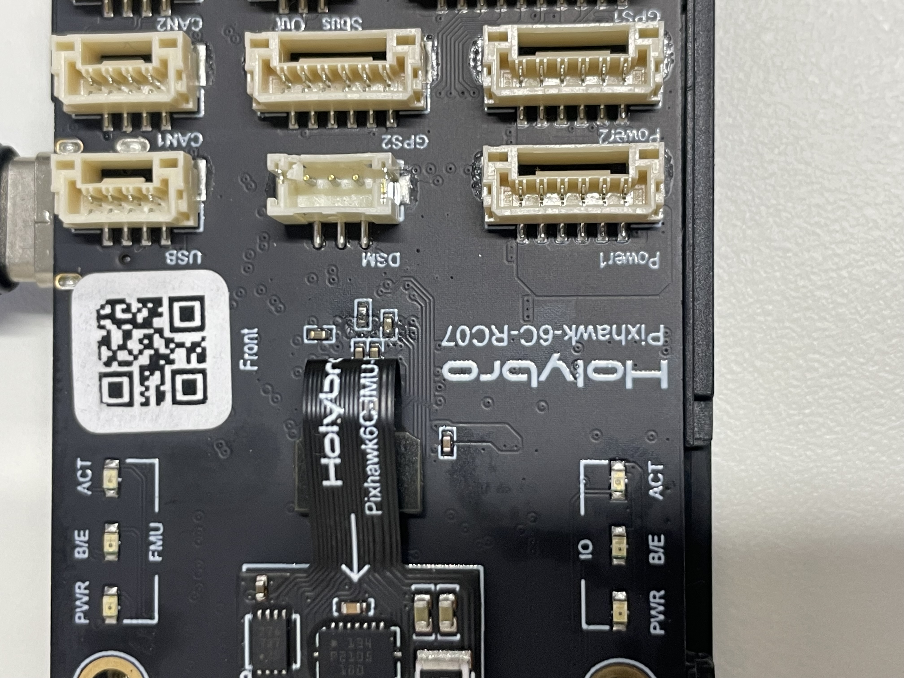

## Pixhawk 6Cブートローダー復旧手順まとめ

### 問題の状況

- ArduPilotカスタムプログラムの書き込み中にエラー発生
- ブートローダーがクラッシュして完全ブリック状態

### 復旧手順

**1. 必要ファイルの入手**

- `Pixhawk6C_bl.hex`ファイルをArduPilot公式サイト(https://firmware.ardupilot.org/Tools/Bootloaders/)から取得
- **重要**: `.abin`ファイルはSDカード用のため、STM32CubeProgrammerでは使用不可
- `.hex`（インテルヘックス形式）が必須

**2. DFUモードへの進入**

- R10とC36の2つの接点をジャンパケーブルなどで短絡させながらUSB ケーブルでPCに接続

  
  

- デバイスマネージャーで「DFU in FS Mode」として認識されることを確認
- 認識されなければ、Zadigツールでドライバを再インストール

**3. STM32CubeProgrammerでのフラッシュ**

- インターフェース：「USB」を選択して接続
- 「Erasing and Programming」ビューを開く
- ファイル選択：`Pixhawk6C_bl.hex`
- **開始アドレス：0x08000000**（ブートローダーの正しい配置場所）
- 「Download」ボタンでフラッシュ実行

**4. 成功確認**

- フラッシュ完了（プログレスバー100%）
- メモリビューでアドレス0x08000000からデータが確認できる
- ログに「Data read successfully」表示

**5. 通常モードへの復帰**

- ボードをリセット（電源再投入）
- Mission PlannerやQGroundControlからArduPilotファームウェアを通常通りアップロード可能

### 重要なポイント

- **SDカード経由での復旧は不可能**（ブートローダーが存在しないため）
- **`.hex`形式が必須**（アドレス情報が埋め込まれている）