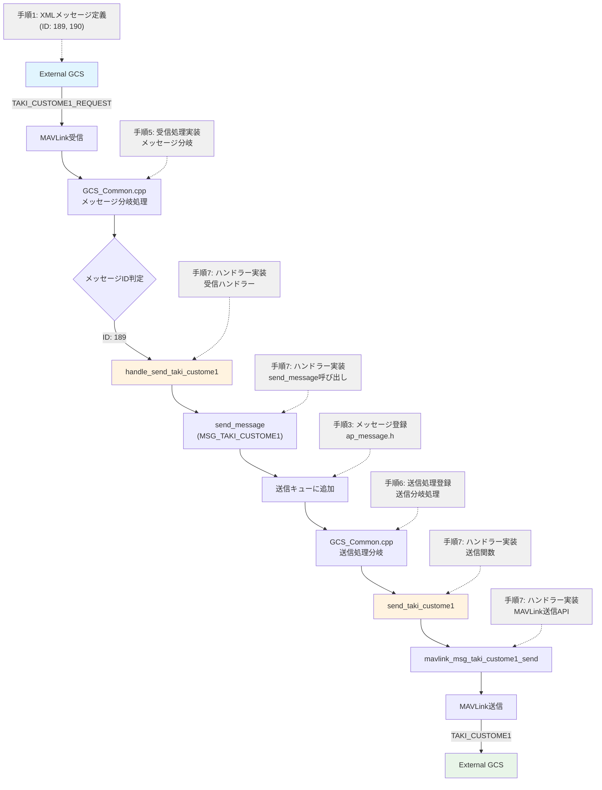
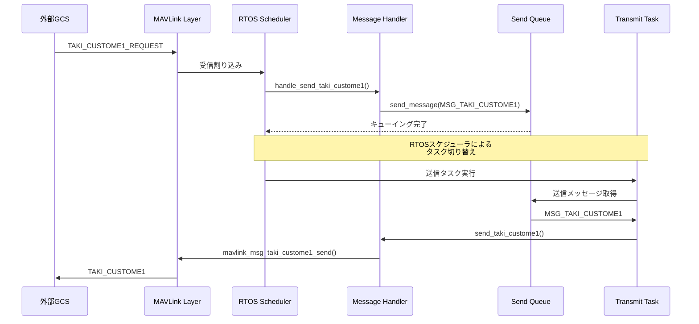
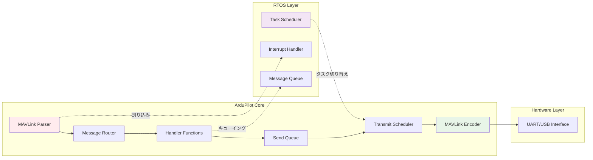

# ArduPilotカスタムMAVLinkメッセージ追加手順

ArduPilotにカスタムMAVLinkメッセージを追加し、送受信を実装する手順を以下にまとめます。

## **手順概要**

### **1. XMLメッセージ定義**

まず、リクエスト用とレスポンス用の2つのメッセージを定義します。

**リクエストメッセージ (ID: 189)**

```xml
<message id="189" name="TAKI_CUSTOME1_REQUEST">
  <description>Custom request message</description>
</message>
```

**レスポンスメッセージ (ID: 190)**

```xml
<message id="190" name="TAKI_CUSTOME1">
  <description>Simple custom message for testing</description>
  <field type="uint32_t" name="test_counter">Test counter value</field>
  <field type="uint16_t" name="taki_system_id">System ID</field>
  <field type="uint16_t" name="taki_component_id">Component ID</field>
</message>
```


### **2. ビルド設定追加**

`GCS_config.h`にコンパイル設定を追加：

```cpp
// enable custom TAKI_CUSTOME1_REQUEST handling
#define AP_MAVLINK_TAKI_CUSTOME_REQUEST_ENABLED 1
```


### **3. メッセージ登録**

`ap_message.h`の最後にメッセージを追加：

```cpp
#if AP_MAVLINK_TAKI_CUSTOME_REQUEST_ENABLED
    MSG_TAKI_CUSTOME1,
#endif    
    MSG_LAST // MSG_LAST must be the last entry in this enum
```


### **4. ハンドラー宣言**

`GCS.h`にハンドラー関数を宣言：

```cpp
#if AP_MAVLINK_TAKI_CUSTOME_REQUEST_ENABLED
void handle_send_taki_custome1(const mavlink_message_t &msg);
void send_taki_custome1() const;
#endif
```


### **5. 受信処理実装**

`GCS_Common.cpp`の受信処理部分に追加：

```cpp
#if AP_MAVLINK_TAKI_CUSTOME_REQUEST_ENABLED
    case MAVLINK_MSG_ID_TAKI_CUSTOME1_REQUEST:
        handle_send_taki_custome1(msg);
        break;
#endif
```


### **6. 送信処理登録**

`GCS_Common.cpp`の送信処理部分に追加：

```cpp
#if AP_MAVLINK_TAKI_CUSTOME_REQUEST_ENABLED
    case MSG_TAKI_CUSTOME1:
        CHECK_PAYLOAD_SIZE(TAKI_CUSTOME1);
        send_taki_custome1();
        break;
#endif
```


### **7. ハンドラー実装**

`GCS_Common.cpp`にハンドラー関数を実装：

**受信ハンドラー**

```cpp
#if AP_MAVLINK_TAKI_CUSTOME_REQUEST_ENABLED
void GCS_MAVLINK::handle_send_taki_custome1(const mavlink_message_t &msg)
{
    send_message(MSG_TAKI_CUSTOME1);
}
#endif
```

**送信関数**

```cpp
void GCS_MAVLINK::send_taki_custome1() const
{
    static uint32_t test_counter = 0;
    test_counter++;
    
    mavlink_msg_taki_custome1_send(
        chan,
        test_counter,                    // test_counter
        mavlink_system.sysid,           // taki_system_id
        mavlink_system.compid           // taki_component_id
    );
}
```


## **メッセージ処理フロー**




## **RTOS/MAVLink処理統合図**




## **システム内部アーキテクチャ**



この実装により、外部GCSからのリクエストメッセージに対して、ArduPilot内部でカウンターを含むカスタムレスポンスメッセージを返送する仕組みが構築されます。処理はRTOSのタスクスケジューラによって管理され、MAVLinkの送受信キューを通じて非同期に実行されます。

