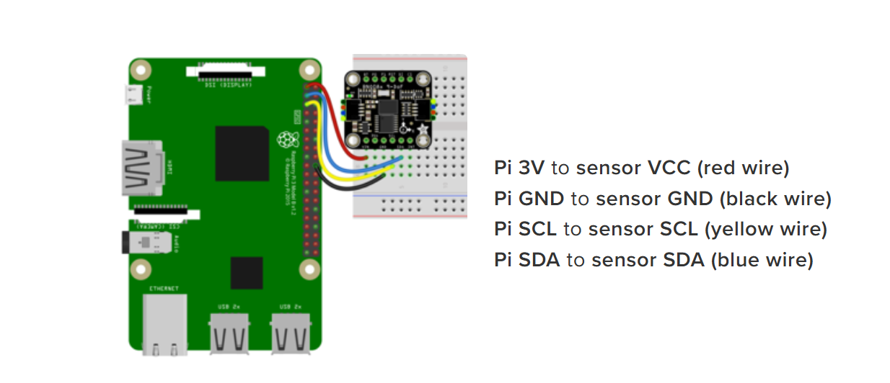

# Raspi5にインストール

- 12Cで通信する。ボーレート400kHz

- 設定しなくても大丈夫っぽい

公式

https://docs.circuitpython.org/projects/bno08x/en/latest/ [cite: 1]

データシート

https://cdn-learn.adafruit.com/downloads/pdf/adafruit-9-dof-orientation-imu-

fusion-breakout-bno085.pdf [cite: 1]

Raspberry pi 5で環境構築する

adafruitのライブラリはサーキットパイソン (マイコン用) でしか動かないため、

Raspberry pi 5で使用するためには、Blinkaをインストールする必要がある。 [cite: 1]

Blinkaをインストール

https://learn.adafruit.com/circuitpython-on-raspberrypi-linux/installing-

circuitpython-on-raspberry-pi [cite: 1]

を参照

この中で仮想環境を実装する必要がある。 [cite: 1]

仮想環境

入り方 (BNO085) という仮想環境を作った時の

source BNO085/bin/activate [cite: 1]

Blinkaを入れるとしたの姿勢センサライブラリがインストールできるようになる

sudo pip3 install adafruit-circuitpython-bno08x [cite: 1]

https://univ291.sharepoint.com/sites/mech.umemotolab/_layouts/15/Doc.aspx?sourcedoc=(a9b7a381-02d0-41a6-a4e8-2b62d450c29c)&action=e... [cite: 1, 2]

[def]: Getlmage.png