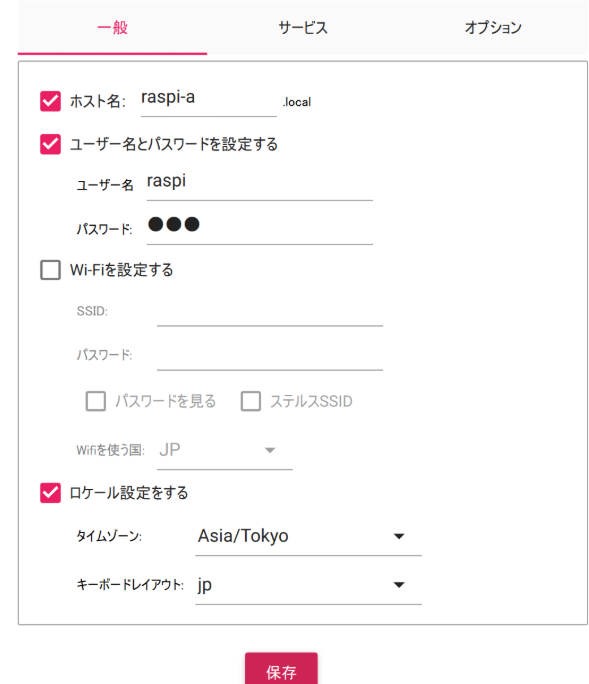
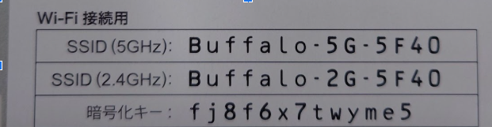

# Raspberry Pi 5 セットアップ手順（Lite OS・SSH接続）

## 1. Raspberry Pi Imager の準備とOS書き込み

### 手順概要
1. Raspberry Pi Imager をPCにインストール  
   [公式サイト](https://www.raspberrypi.com/software/)からダウンロード可能。

2. 書き込む内容を選択:
   - **デバイス**: Raspberry Pi 5
   - **OS**: `Other` → `Raspberry Pi OS Lite (64-bit)`
   - **ストレージ**: 挿入したSDカード

3. 歯車アイコンの「詳細設定」をクリックし、以下を設定:
   - ホスト名: （例）`raspi-a`（各班の名前が割り振られているのでそれに従う）
   - ユーザー名とパスワード: 任意に設定し、**必ずメモしておく**（単純でよい）
   - Wi-Fi設定: **ここでは設定しない**
   - SSH: 有効化し、「パスワード認証を使用」にチェック

1. 書き込み実行:
   - 「保存」→「書き込み」ボタンでSDカードにOSを書き込む




---

## 2. Raspberry Pi の起動とWi-Fi設定

1. SDカードを Raspberry Pi 5 に挿入し、USB-C 給電（PC等で給電すると電圧電流が足りず、カメラなどの不具合の原因になる）
2. HDMI モニターと USB キーボードを接続して起動
3. ターミナルで以下を実行:

```bash
sudo raspi-config
```

   * 「Network Options」または「1. System Options」→「S1 Wireless LAN」
   * Wi-FiのSSIDとパスワードを入力
   * 完了後、「Finish」で終了



1. IPアドレスの確認:

```bash
ifconfig
```

   * `wlan0` の `inet` の値（例：192.168.11.xx）をメモしておく

---

## 3. SSHによる接続（PCから）

pcをRaspberry Piをと同じネットワークに接続する（校内Wi-Fiでは不可）
PCのターミナル（例：PowerShell）で以下のいずれかのコマンドを実行:


```bash
ssh [ユーザー名]@[ホスト名]
# 例:
ssh pi@raspi-a

ssh [ユーザー名]@[IPアドレス]
# 例:
ssh pi@192.168.11.40
```


初回接続時は「yes」と入力して鍵を保存。

---

## 4. トラブルシューティング

### 🔁 書き込み後ログインできない場合

* SDカードの中身を再フォーマットしてから書き込みをやり直す

  * ディスクの管理から **ボリュームの削除**
  * エクスプローラーで **FAT32としてフォーマット**
  * その後、再度 Raspberry Pi Imager で書き込み

### 🛑 SSH接続エラー（鍵の衝突）の場合

ローカルPCに古い鍵が残っていてエラーが出るときは以下を実行:

```bash
ssh-keygen -R [IPアドレス]
# 例:
ssh-keygen -R 192.168.11.40
```

その後、再度SSH接続。

---

## 🔚 補足

* Raspberry Pi OS Lite はGUIがないため、最小構成で使いたい用途（IoT・自動制御など）に最適。
* SSH有効化を忘れた場合は、SDカードの`boot`パーティションに空ファイル `ssh` を作成することで手動でも有効化できる。
* 初回起動には少し時間がかかることがあるので、数分待つこと。
